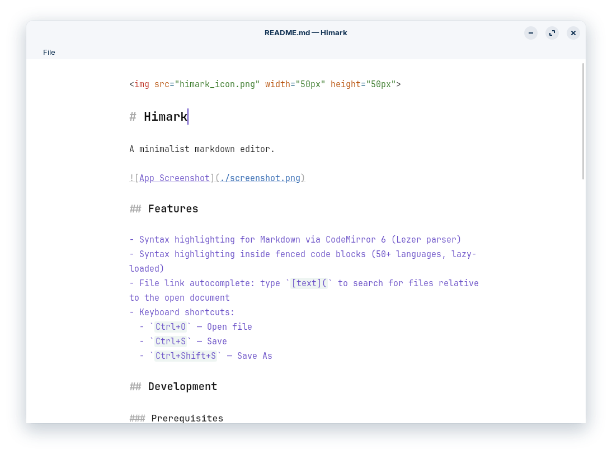

# Himark

A minimalist markdown editor.



## Features

- Syntax highlighting for Markdown via CodeMirror 6 (Lezer parser)
- Syntax highlighting inside fenced code blocks (50+ languages, lazy-loaded)
- Auto-save with 1.5 s debounce
- File link autocomplete: type `[text](` to search for files relative to the open document
- Keyboard shortcuts:
  - `Ctrl+O` — Open file
  - `Ctrl+S` — Save
  - `Ctrl+Shift+S` — Save As
  - `Ctrl+-/+` — Zoom out/in

## Development

### Prerequisites

- **Node.js ≥ 18**

- **Rust**

```bash
curl --proto '=https' --tlsv1.2 -sSf https://sh.rustup.rs | sh
source ~/.cargo/env
```

- **System libraries (Linux)**

```bash
# Ubuntu / Debian
sudo apt update && sudo apt install -y \
  libwebkit2gtk-4.1-dev \
  libappindicator3-dev \
  librsvg2-dev \
  patchelf \
  libssl-dev \
  build-essential \
  curl \
  wget \
  file \
  libgtk-3-dev
```

### Build/dev commands

```bash
npm install
npm run tauri dev
```

```bash
npm run tauri build
```

More build options can be found [here](https://tauri.app/reference/cli/#build).

The packaged app will be in `src-tauri/target/release/bundle/`.

## License

Licensed under the MIT license.